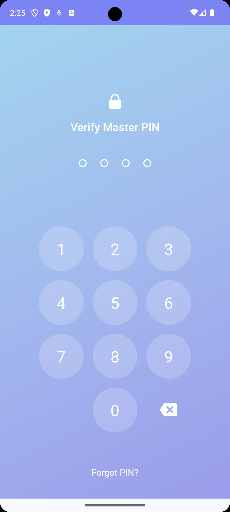
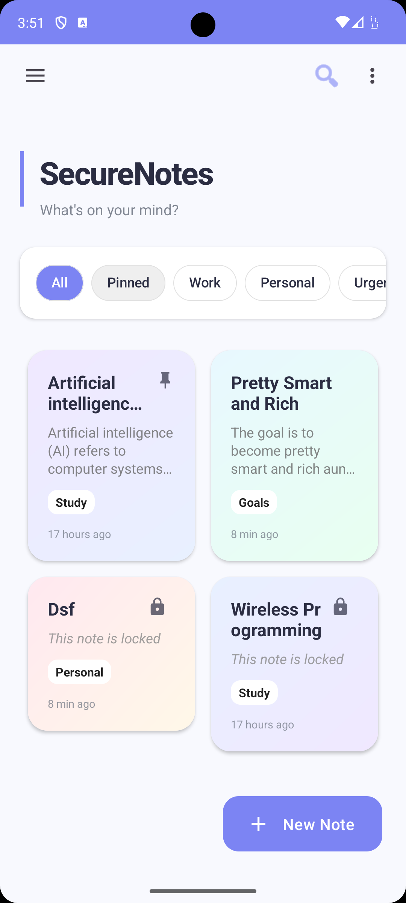
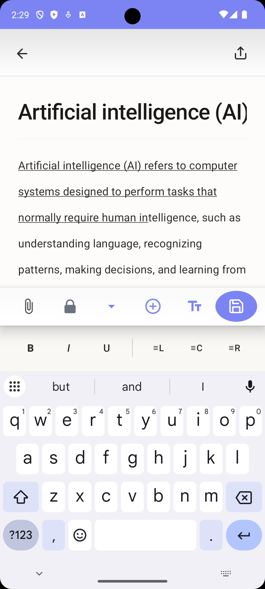
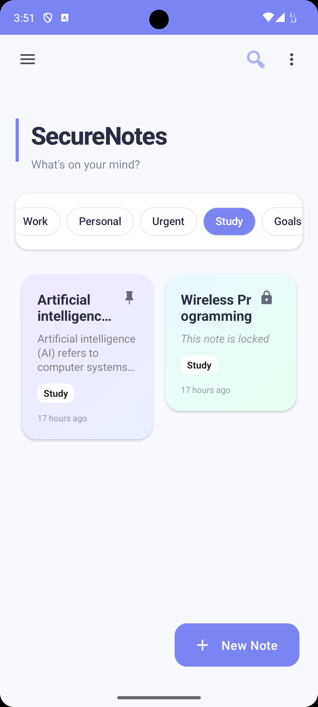
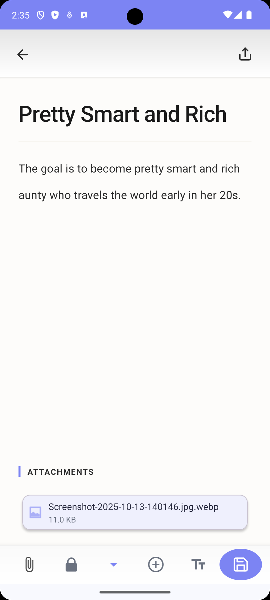
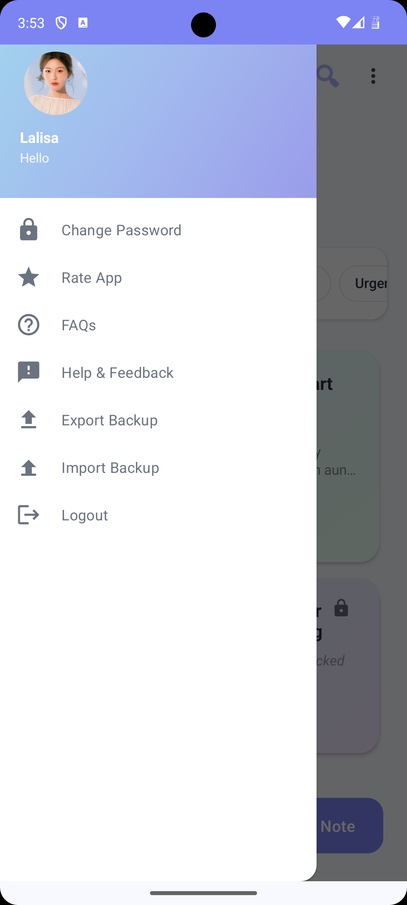

<div align="center">

# SecureNotes

### Privacy-First Encrypted Note-Taking Application for Android

*Your notes. Your device. Zero cloud. Total privacy.*

[](https://www.android.com/)
[](https://android-arsenal.com/api?level=24)
[](LICENSE)
[](https://en.wikipedia.org/wiki/Advanced_Encryption_Standard)

[Features](#key-features) • [Security](#security-architecture) • [Screenshots](#screenshots) • [Installation](#installation) • [Tech Stack](#tech-stack)

---

</div>

## Overview

**SecureNotes** is a military-grade encrypted note-taking application built for Android that prioritizes user privacy and data security above all else. Unlike traditional note apps that sync to the cloud, SecureNotes keeps everything **local**, **encrypted**, and **under your control**.

### Why SecureNotes?

- **100% Offline** - No internet permissions, no data transmission
- **Military-Grade Encryption** - AES-256-GCM encryption for all data
- **Zero-Knowledge Architecture** - Your data, your keys, your control
- **Per-Note Lock** - Lock individual notes with separate passwords for maximum security
- **No Cloud Sync** - All notes stored locally on your device
- **Open Source** - Transparent and auditable security implementation

---

## Key Features

### Advanced Security

<table>
<tr>
<td width="50%">

#### Multi-Layer Encryption
- **Master PIN Protection** - Secure app access with PIN authentication
- **Per-Note Password Lock** - Individual notes can be locked with separate passwords for extra security
- **AES-256-GCM Encryption** - Industry-standard encryption algorithm
- **Android KeyStore Integration** - Hardware-backed key storage
- **Secure Delete** - Notes moved to trash before permanent deletion

</td>
<td width="50%">

#### Privacy Guarantees
- **No Network Permissions** - Physically impossible to transmit data
- **Local-Only Storage** - Everything stays on your device
- **Encrypted Attachments** - Files secured with same encryption
- **Secure Backups** - Export encrypted backup files
- **Profile Security** - Password change and security settings

</td>
</tr>
</table>

> **Note Security Highlight**: SecureNotes offers dual-layer protection. Every note is encrypted with your master PIN, and you can add an additional password lock to specific notes for ultra-sensitive information. This means even if someone gains access to your device with the master PIN, your most private notes remain protected.

### Rich Note-Taking Experience

- **Rich Text Support** - Format your notes with style
- **To-Do Lists** - Built-in task management with checkboxes
- **File Attachments** - Images, voice recordings, documents
- **Category Organization** - Organize notes into custom categories (General, Work, Study, Personal, Goals, Travel, Journal)
- **Per-Note Lock** - Additional password protection for individual sensitive notes
- **Fast Search** - Quick search across all notes with on-device indexing
- **Favorites & Pinning** - Keep important notes at the top
- **Trash Management** - Recover accidentally deleted notes
- **Note Colors** - Visual organization with color-coded notes

### Modern User Experience

- **Material Design 3** - Clean, modern interface with gradient backgrounds
- **User Profile** - Personalized profile with avatar support
- **Custom Themes** - Personalize your note-taking experience
- **Responsive UI** - Optimized for all screen sizes
- **Performance** - Smooth, fast, and lightweight
- **No Ads** - Distraction-free note-taking
- **Drawer Navigation** - Easy access to all app features
- **Help & FAQ** - Built-in help system and feedback options

---

## Security Architecture

SecureNotes implements multiple layers of security to ensure your data remains private and secure.

### Encryption Implementation

```
┌─────────────────────────────────────────┐
│         User Authentication             │
│    (PIN + Biometric Support)            │
└──────────────┬──────────────────────────┘
               │
               ▼
┌─────────────────────────────────────────┐
│      Android KeyStore (AES-256)         │
│   Hardware-Backed Key Generation        │
└──────────────┬──────────────────────────┘
               │
               ▼
┌─────────────────────────────────────────┐
│         AES-256-GCM Encryption          │
│  • Note Content                         │
│  • Attachments                          │
│  • Metadata                             │
└──────────────┬──────────────────────────┘
               │
               ▼
┌─────────────────────────────────────────┐
│       Room Database (Encrypted)         │
│     Local SQLite Storage                │
└─────────────────────────────────────────┘
```

### Technical Security Details

| Security Feature | Implementation |
|-----------------|----------------|
| **Encryption Algorithm** | AES-256-GCM with AEAD |
| **Key Storage** | Android KeyStore (Hardware-backed) |
| **Authentication** | PBKDF2 for PIN-based key derivation |
| **Per-Note Encryption** | Separate encryption layer with user-defined passwords |
| **IV Management** | Unique IV per encryption operation |
| **Backup Security** | Password-protected encrypted exports |

### Code Example

```java
public class EncryptionUtil {
    private static final String ANDROID_KEY_STORE = "AndroidKeyStore";
    
    public static String encrypt(String plainText) {
        SecretKey key = getSecretKey();
        Cipher cipher = Cipher.getInstance("AES/GCM/NoPadding");
        cipher.init(Cipher.ENCRYPT_MODE, key);
        
        byte[] iv = cipher.getIV();
        byte[] cipherBytes = cipher.doFinal(plainText.getBytes());
        
        // IV + encrypted data for secure decryption
        return encodeWithIV(iv, cipherBytes);
    }
}
```

---

## Screenshots

<div align="center">

### Main Interface

<table>
<tr>
<td align="center" width="33%">

<br/>
<b>Lock Screen</b>
<br/>
<em>Secure PIN authentication</em>
</td>
<td align="center" width="33%">

<br/>
<b>Notes List</b>
<br/>
<em>Clean, organized interface</em>
</td>
<td align="center" width="33%">

<br/>
<b>Note Editor</b>
<br/>
<em>Rich text editing</em>
</td>
</tr>
</table>

### Advanced Features

<table>
<tr>
<td align="center" width="33%">

<br/>
<b>Categories</b>
<br/>
<em>Organize your notes</em>
</td>
<td align="center" width="33%">

<br/>
<b>Attachments</b>
<br/>
<em>Images, voice, documents</em>
</td>
<td align="center" width="33%">

<br/>
<b>Settings</b>
<br/>
<em>Customization options</em>
</td>
</tr>
</table>

</div>

---

## Installation

### Prerequisites

- **Android Studio** Hedgehog (2023.1.1) or later
- **JDK** 17 or higher
- **Android SDK** API Level 24+ (Android 7.0+)
- **Gradle** 8.0+

### Build Instructions

1. **Clone the repository**
   ```bash
   git clone https://github.com/yourusername/SecureNotes.git
   cd SecureNotes
   ```

2. **Open in Android Studio**
   - Launch Android Studio
   - Select "Open an Existing Project"
   - Navigate to the cloned directory

3. **Sync Gradle**
   - Android Studio will automatically sync Gradle
   - If not, click `File > Sync Project with Gradle Files`

4. **Build the project**
   ```bash
   ./gradlew build
   ```

5. **Run on device/emulator**
   ```bash
   ./gradlew installDebug
   ```

### APK Download

Download the latest release APK from the [Releases](https://github.com/yourusername/SecureNotes/releases) page.

---

## Project Structure

```
SecureNotes/
├── app/
│   ├── src/
│   │   ├── main/
│   │   │   ├── java/com/example/securenote/
│   │   │   │   ├── data/              # Database & Repository layer
│   │   │   │   │   ├── AppDatabase.java
│   │   │   │   │   ├── NoteDao.java
│   │   │   │   │   ├── NoteRepository.java
│   │   │   │   │   └── AuthRepository.java
│   │   │   │   ├── model/             # Data models
│   │   │   │   │   ├── Note.java
│   │   │   │   │   ├── Attachment.java
│   │   │   │   │   └── UserProfile.java
│   │   │   │   ├── ui/                # Activities & Adapters
│   │   │   │   │   ├── MainActivity.java
│   │   │   │   │   ├── AddEditNoteActivity.java
│   │   │   │   │   ├── LockActivity.java
│   │   │   │   │   └── NoteAdapter.java
│   │   │   │   ├── util/              # Utility classes
│   │   │   │   │   ├── EncryptionUtil.java
│   │   │   │   │   ├── PasswordUtil.java
│   │   │   │   │   └── BackupUtils.java
│   │   │   │   └── viewmodel/         # ViewModels
│   │   │   │       └── NoteViewModel.java
│   │   │   ├── res/                   # Resources
│   │   │   │   ├── layout/            # XML layouts
│   │   │   │   ├── drawable/          # Icons & graphics
│   │   │   │   └── values/            # Strings, colors, themes
│   │   │   └── AndroidManifest.xml
│   │   └── test/                      # Unit tests
│   └── build.gradle.kts
└── README.md
```

---

## Tech Stack

### Core Technologies

- **Android SDK** - API Level 24+ (Android 7.0 Nougat and above)
- **Java** - JDK 17 with modern language features
- **Gradle** - 8.0+ build automation
- **Material Design 3** - Latest Android design system

### Key Libraries & Frameworks

| Category | Library | Purpose |
|----------|---------|---------|
| **Database** | Room Persistence Library | Local database with encryption support |
| **Architecture** | Android Jetpack | ViewModel, LiveData, Lifecycle components |
| **Security** | Android KeyStore | Hardware-backed key storage |
| **Security** | Java Cryptography Extension | AES-256-GCM encryption |
| **UI** | Material Design Components | Modern UI components |
| **Data Binding** | Android Data Binding | View-model binding |
| **File Provider** | AndroidX FileProvider | Secure file sharing for attachments |
| **Testing** | JUnit, Espresso | Unit and UI testing |

### Data Models

The application uses several key data models:
- **Note** - Main note entity with title, content, category, timestamp, and encryption metadata
- **TodoItem** - Task items within notes with completion status
- **Attachment** - File attachments linked to notes (images, voice recordings, documents)
- **UserProfile** - User settings and profile information

### Architecture Pattern

**MVVM (Model-View-ViewModel)** with Repository Pattern
- Clean separation of concerns
- Reactive data flow with LiveData
- Testable architecture
- Scalable and maintainable

---

## Testing

### Running Tests

**Unit Tests**
```bash
./gradlew test
```

**Instrumentation Tests**
```bash
./gradlew connectedAndroidTest
```

### Test Coverage

- Encryption/Decryption unit tests
- Database operations testing
- PIN verification logic
- Backup/Restore functionality
- UI component tests

---

## Performance

| Metric | Value |
|--------|-------|
| **App Size** | ~8 MB (APK) |
| **Startup Time** | < 1 second |
| **Encryption Speed** | ~50ms per note |
| **Memory Usage** | ~30 MB (active) |
| **Battery Impact** | Minimal (no background services) |

---

## Privacy Policy

SecureNotes is designed with privacy at its core:

- **No data collection** - We don't collect any user data
- **No analytics** - No tracking or telemetry
- **No internet access** - App has no network permissions
- **No third-party services** - No external dependencies
- **Open source** - Fully auditable codebase
- **Local storage only** - All data stays on your device

---

## Roadmap

### Version 2.0 (Planned)

- [ ] Biometric authentication support
- [ ] Dark mode themes
- [ ] Note templates
- [ ] Export to PDF
- [ ] Advanced search filters
- [ ] Note sharing (encrypted)
- [ ] Markdown support
- [ ] Voice-to-text notes
- [ ] Widget support

---


## License

This project is licensed under the MIT License - see the [LICENSE](LICENSE) file for details.

---

## Author

**Praisilia Anastasya Pandoh**
- GitHub: [@praisi-tech](https://github.com/praisi-tech)
- LinkedIn: [Praisilia Pandoh](https://linkedin.com/in/praisiliapandoh) 
- Email: praisilia.productive@gmail.com

---

## Acknowledgments

- Android KeyStore documentation and security best practices
- Material Design 3 guidelines
- Open source community for inspiration and support
- Security researchers for encryption implementation guidance

---


### Built with Security in Mind

*SecureNotes - Your Privacy, Our Priority*

**[Back to Top](#securenotes)**

</div>
